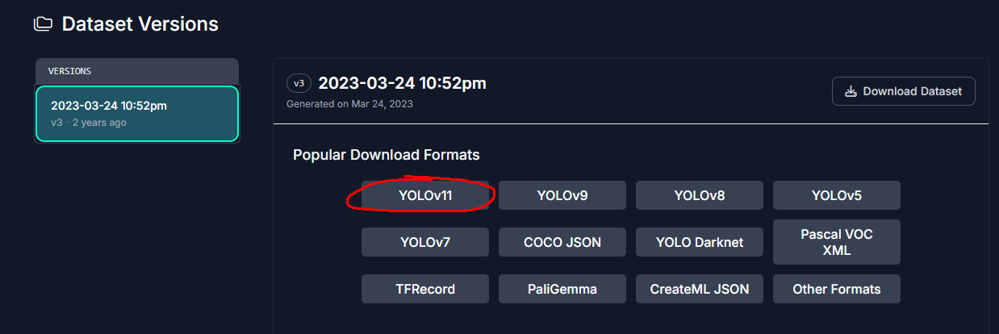
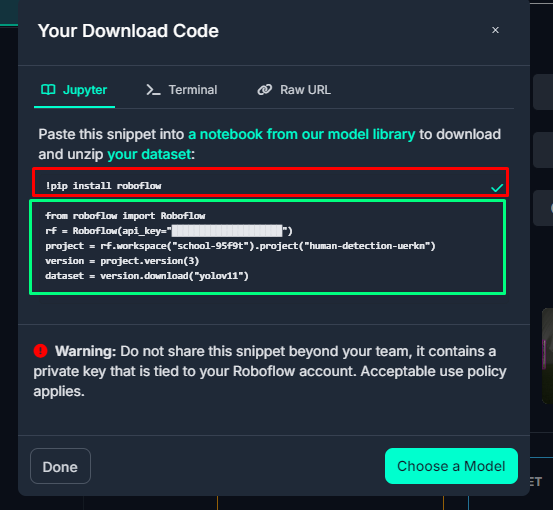
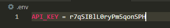
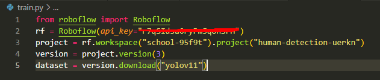
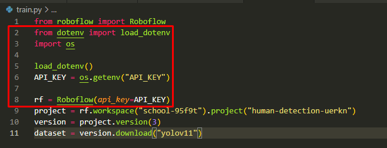

# Soccer Prediction using Computer Vision
Computer Vision of Players and Football using Yolo from Utltralytics  
Yolov11 Models [Link](https://docs.ultralytics.com/models/yolo11/#supported-tasks-and-modes)

# Quick Start Guide

# 1. Go to [Human Detection Computer Vision Project](https://universe.roboflow.com/school-95f9t/human-detection-uerkn)

# 2. Download [Dataset](https://universe.roboflow.com/school-95f9t/human-detection-uerkn/dataset/3) in YOLO format 



# 3. Select "show download code" and paste the content into a "download.py" file. Make sure to create your virtual environment [(link on how to create a venv)](https://code.visualstudio.com/docs/python/environments) and download the dependencies.

## P.S. To train the model, you only need the code highlighted in the green box below, the code in red box is just to install the dependeny, remove it from your download.py file, I already have a requirements.txt compiled so just run 

```
pip install -r requirements.txt
```



# 4. Now create an environment file ".env", this is where you are going to keep your secret keys such as API keys. In this file you should have your API key set up as so



## This is a fake API key ofcourse, you need to have your own, and make sure that ".env" is in your ".gitignore" file, so whenever you push on to your GitHub repository, you won't leak any secret information.

## Modify your download.py like so 

## From



## To



# 5. Download your dataset by running the download.py file, and take a look and try to understand the data set and the file structure. 
```
python download.py
```

# 6. Train your custom model on top of an existing pre-trained YOLO model

```python
from ultralytics import YOLO


model = YOLO('yolov11.pt')


# Training.
from ultralytics import YOLO


model = YOLO('yolo11s.pt')


# Training.
results = model.train(
   data=r'D:\Developer\soccer-prediction\Human-Detection-3\data.yaml',
   imgsz=640,
   epochs=20,
   batch=8,
   save=True,
   device = "cpu",
   pretrained = True,
   name='soccer_detection')
```


